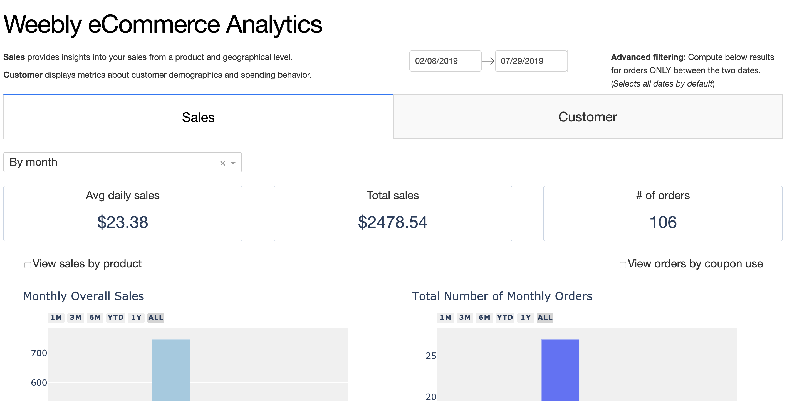

# Weebly e-Commerce Analytics (WeA)

**_WeA is a dashboard that visualizes product-oriented, customer-focused insights about your Weebly store's sales._**

Built using [Dash](https://github.com/plotly/dash), Weebly e-Commerce Analytics offers a minimalist web app that enables easy insight into your Weebly store's order data, beyond [Weebly's default viewer](https://www.weebly.com/home/insights).




# Use

This Dash web app allows you to analyze your Weebly e-commerce store's [order data](https://www.weebly.com/editor/main.php#/store/orders).

Currently I have it set specifically for [vocetea.com](vocetea.com), but this app works for any Weebly store order data.

# Installation and Running

Recommended to use a virtualenv. Then run the following:

```
pip install -r requirements.txt #installs depencies
python app.py
```
Then go to [http://localhost:8050](http://localhost:8050)

# Example
You can see the app in action [here](https://voceanalytics.herokuapp.com/)
