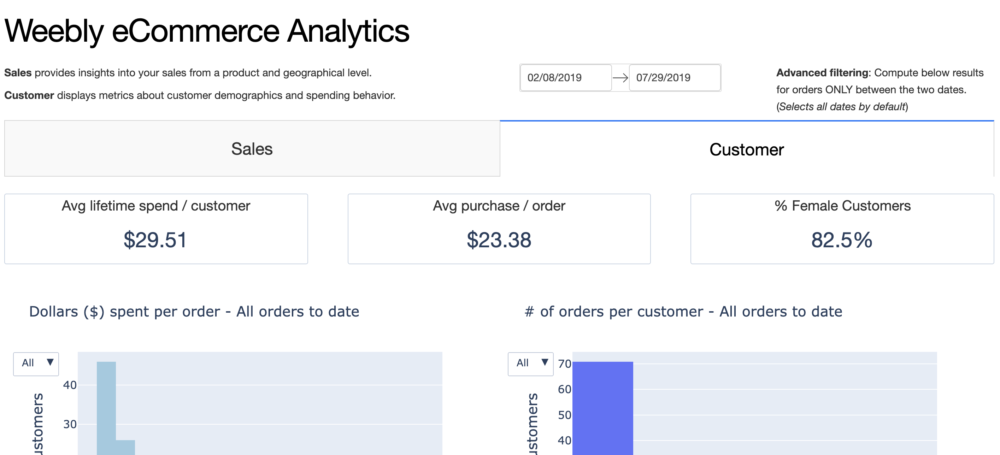

# Weebly e-Commerce Analytics (WeA)

**_WeA is a dashboard that visualizes product-oriented, customer-focused insights about your Weebly store's sales._**

Built using [Dash](https://github.com/plotly/dash), Weebly e-Commerce Analytics offers a minimalist web app that enables easy insight into your Weebly store's order data, beyond [Weebly's default viewer](https://www.weebly.com/home/insights).



Check out this [live demo](https://weeblyanalytics.herokuapp.com/) of the tool.

## Basic Use (using online demo)

If you want to immediately use the tool without any installation, use the instructions below.

1. Download your Weebly store's order data in CSV format by going [here](https://www.weebly.com/editor/main.php#/store/orders) and clicking "Export Orders."

2. Go to the [live demo](https://weeblyanalytics.herokuapp.com/) of the app and upload your CSV file there. The demo is hosted for free on Heroku, so be prepared to wait 15-20 seconds for the webpage to load.

**Note: No user order data is or will ever be stored on the server. Your data belongs to you.**

If you refresh or exit the page, you will have to re-upload your store data to construct the graphs again.

## Installation (for offline use/modification)

If you wish to use this tool offline or modify this tool for your own purposes, please follow the below instructions.

It is recommended to use a [Python virtual environment](https://uoa-eresearch.github.io/eresearch-cookbook/recipe/2014/11/26/python-virtual-env/). 

After cloning or downloading the files, run the following (using virtual environment) in the main directory of the folder:

```
pip install -r requirements.txt 
python app.py
```
Then go to [http://localhost:8050](http://localhost:8050). You can modify app.py afterwards. All changes to the code will automatically refresh and update the localhost.
